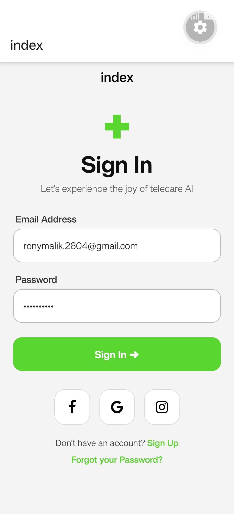

# Telecare AI Sign In UI

A clean and modern React Native Sign In screen inspired by a telecare AI application design.

## Preview



---

## Features

- Clean modern UI
- React Native beginner friendly
- Responsive spacing
- Social login buttons
- Styled input fields
- Simple and readable code structure

---

## Built With

- React Native
- Expo
- JavaScript
- Expo Vector Icons

---

## Installation

Clone the repository:

```bash
git clone https://github.com/your-username/telecare-ui.git
```

Install dependencies:

```bash
npm install
```

Start the Expo server:

```bash
npx expo start
```

---

## Dependencies

Install vector icons:

```bash
npx expo install @expo/vector-icons
```

---

## Folder Structure

```bash
telecare-ui/
│
├── assets/
│   └── screenshot.png
│
├── App.js
├── package.json
└── README.md
```

---

## Learning Goals

This project helped practice:

- Flexbox layouts
- React Native styling
- Inputs and buttons
- Component structure
- UI spacing and alignment
- Mobile-first design thinking

---

## Screenshot Setup

1. Take a screenshot of your app
2. Rename it to:

```bash
screenshot.png
```

3. Put it inside:

```bash
assets/
```

---

## Author

Made with ❤️ by Rohan